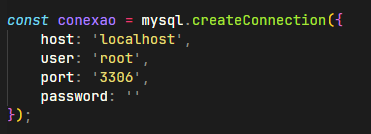

# Api de Prática Financeira - Grupo 23 - Trilhas Inova

## Como rodar localmente a api

1. Entre na pasta desejada e clone o repositório

        git clone https://github.com/SAVANOo/pratica-financeira-api

2. Entre na pasta do projeto 

        cd pratica-financeira-api

3. Instale as dependendias NodeJs

        npm install

4. Configure as variáveis de ambiente da conexão do banco em conexão.js
    
    - Ambiente configurado para rodar com o WAMPP:
    
      
5. Rode o projeto 

        npm run dev

6. Assim que rodar o servidor será executado na porta 3000 e no console aparecerá a mensagem

    ``Servidor rodando aqui localhost:3000``

7. Se for a primeira vez rodando e não possui o banco de dados já criado, a api criará o banco de dados (praticasfinanceirasdb) e as colunas necessárias (database.js)

## Rotas da Api

### Buscar um usuário conforme seu id no banco

#### ```/usuarios/show/${id}``` 
